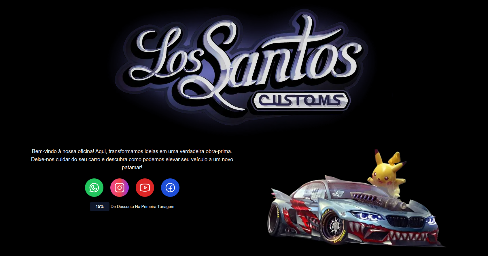

# 🚗 Los Santos Customs  

    

**Status:** ✅ Em Desenvolvimento  

A **Landing Page da Oficina Automotiva** é um projeto desenvolvido com **Next.js** e **Tailwind CSS**, inspirado na icônica **Los Santos Customs** do jogo **GTA 5**. Criado para apresentar uma oficina especializada em tunagem e personalização de veículos, o objetivo é fornecer informações sobre a empresa.

## 🔧 Tecnologias Utilizadas

- **Next.js** para estrutura do projeto
- **Tailwind CSS** para estilização

## 📌 Funcionalidades Atuais

✔️ Seção de Apresentação (**Hero**)  
✔️ Integração com redes sociais (WhatsApp, Instagram, YouTube e Facebook)  
✔️ Seção "Sobre" com detalhes da oficina  
✔️ Chamada para contato via WhatsApp e localização  
✔️ Responsividade e otimização  

## 🚀 Funcionalidades em Desenvolvimento

🔹 Melhoria na acessibilidade e usabilidade  
🔹 Integração com API de mapas para localização dinâmica  
🔹 Formulário de contato para agendamentos  
🔹 SEO aprimorado para melhor indexação  
🔹 Animações e efeitos visuais adicionais  
